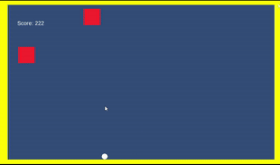
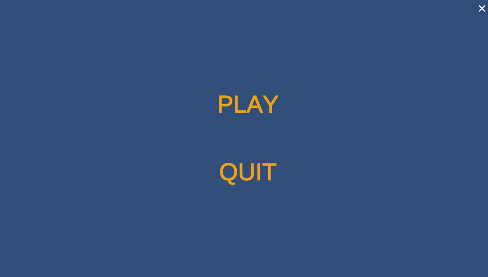
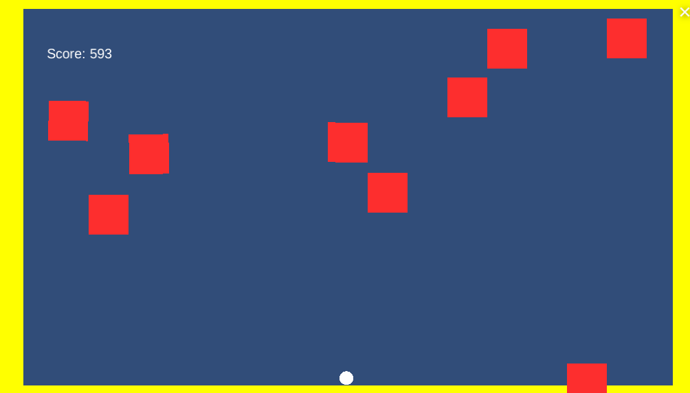
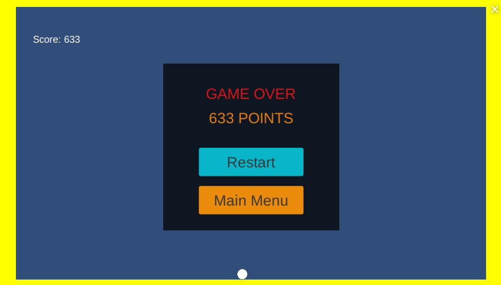

## Bricks_Game
 A 2D simple bricks game made using Unity 

## Project Description
A 2 Dimensional game project build through Unity which includes the creation of objects and a little C programming. The bricks game consists of 2 objects, falling bricks and a ball which the user will be controlling. By using the left and right keys, the user has to dodge the falling bricks to accumulate his/her score. The score is measured in frames per second(fps).

## How to play the game in 4 easy steps!
**Step 1.** Simply press the [link](https://play.unity.com/u/Darien2805) and wait for the website to load!

**Step 2.** Once loaded, a menu screen will be displayed. Click the "Play" button

**Step 3.** Control the ball by pressing the left and right arrow keys! Make sure to avoid the falling bricks!

**Step 4.** Once the brick hits the ball, it is Game Over! The game over screen will be displayed with your score. Users will be given the option to either Quit or Restart. 
* By pressing the Restart button, the game will be loaded immediately.
* By pressing the Quit button, you will be brought to the menu screen

## References:
* An introduction to Unity [Youtube](https://www.youtube.com/watch?v=Bhqmo45Q0Nk)
* Create great GAME OVER screen in Unity UI - Unity tutorial [Youtube](https://www.youtube.com/watch?v=K4uOjb5p3Io)
* START MENU in Unity [Youtube](https://www.youtube.com/watch?v=zc8ac_qUXQY)

:grinning: :smile: :laughing: :rofl: :smiley: :grin: :joy: :upside_down_face: :stuck_out_tongue_closed_eyes:
What are you waiting for? Press this [link](https://play.unity.com/u/Darien2805) to start playing!